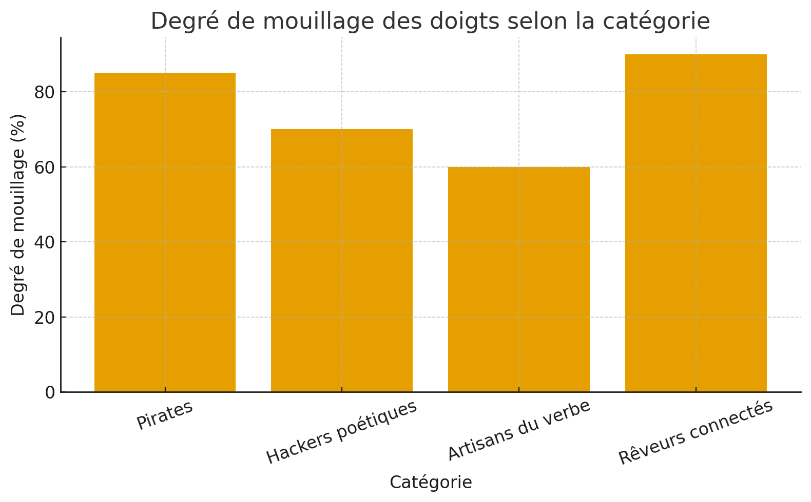
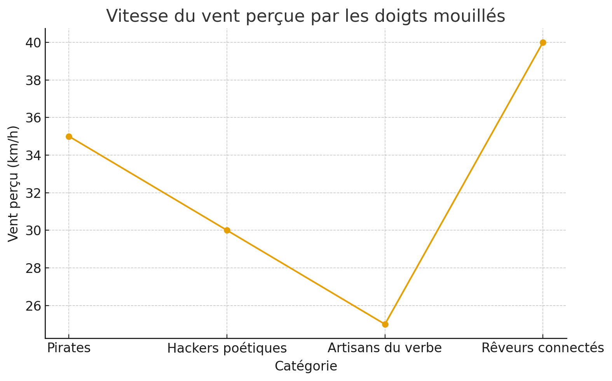
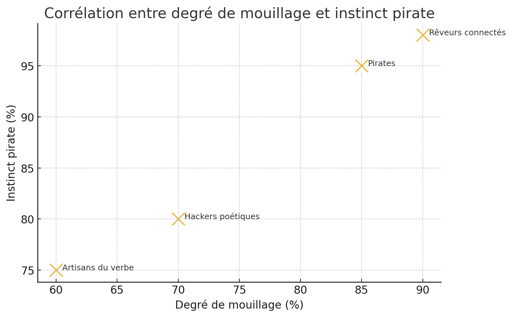

# 🏴‍☠️ Les Pirates au doigts mouillés  
### *Un vent de révolte souffle sur les mers numériques.*

---

## 🌊 Le manifeste

Nous sommes **les Pirates au doigts mouillés**,  
ceux qui sentent d’où vient le vent avant qu’il ne souffle.  
Ni corsaires du pouvoir, ni marchands d’algorithmes :  
nous naviguons à vue, le regard tourné vers l’horizon du possible.  

Ici, on ne télécharge pas des rêves,  
on les **code, les chante et les partage**.  
Notre pavillon n’est pas noir, il est **multicolore** :  
fait de pixels libres, de mots indociles et de données libérées.  

---

## ⚙️ Le projet

**Les Pirates au doigts mouillés** est une expérience collective et créative à la croisée de l’art, de la technologie et de la résistance douce.  
Un laboratoire d’idées, un navire atelier où se croisent :

- 🧭 **Hackers poétiques** – qui détournent les lignes de code comme des vers libres.  
- 🪶 **Artisans du verbe** – qui écrivent des tempêtes dans le calme des ports.  
- ⚡ **Révolutionnaires numériques** – qui refusent le statu quo des algorithmes propriétaires.  
- 🌐 **Rêveurs connectés** – qui croient encore en l’utopie du partage.

---

## 🔥 La révolution pirate

Nous prônons la **désobéissance créative**.  
Nous défendons la **liberté de naviguer sans boussole imposée**.  
Nous croyons que la **technologie peut être poétique**,  
et que la **poésie peut être politique**.  

Notre cri n’est pas celui de la guerre,  
mais celui de la **création insoumise**.  
Nous jetons l’ancre dans les eaux troubles du monde numérique  
pour y tracer de nouveaux courants.  

---

## 🚢 Rejoindre l’équipage

Tu veux embarquer ?  
Aucun mot de passe, aucun serment.  
Seulement l’envie de **réécrire la carte du monde**  
avec de l’encre libre et des lignes de code trempées dans la mer.  

**Rejoins la flotte.**  
Le vent est chaud, les doigts sont mouillés,  
et la révolution commence au bout du clavier.  

